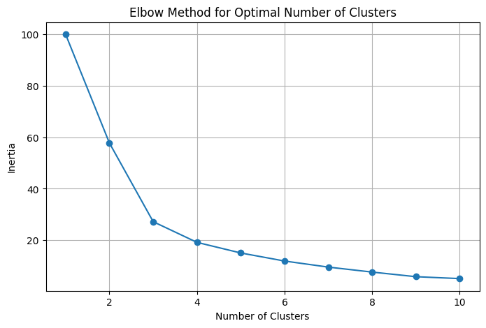
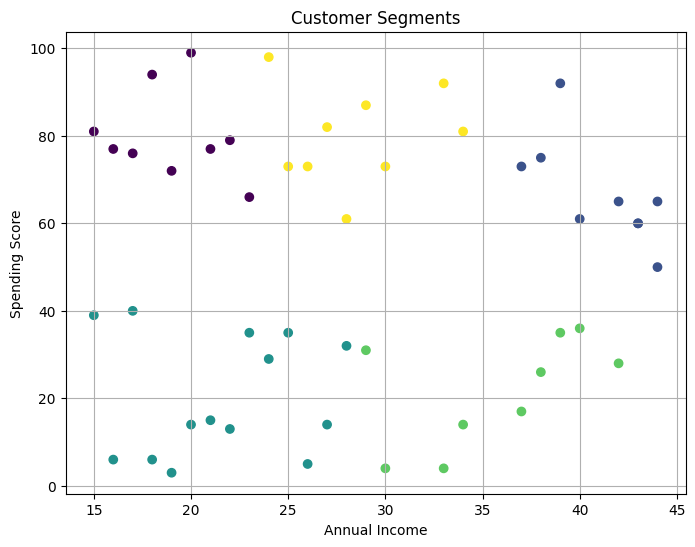

# Customer Segmentation Analysis

## Project Overview
This project uses Python to analyze customer data and identify distinct customer groups based on annual income and spending score. The aim is to help businesses understand customer behavior and support targeted marketing strategies.

## Tools Used
- Python
- Pandas
- NumPy
- Matplotlib
- Scikit-learn

## Project Files
- `dataset.csv` — raw dataset used for the analysis
- `customer_segmentation.ipynb` — Jupyter notebook containing the analysis
- `customer_segments_output.csv` — dataset with assigned customer clusters
- `cluster_summary.csv` — summary statistics for each cluster
- `elbow_method.png` — chart used to help determine the number of clusters
- `customer_segments.png` — scatter plot showing customer segments

## Project Steps
1. Loaded and cleaned the dataset
2. Selected Annual Income and Spending Score as clustering features
3. Standardized the data
4. Used the elbow method to estimate the optimal number of clusters
5. Applied K-Means clustering
6. Visualized the resulting customer segments
7. Exported the segmented dataset and cluster summary

## Key Insights
- Customers were grouped into different segments based on income and spending patterns
- Some customers had high income with high spending behavior
- Some customers had low income with low spending behavior
- The project demonstrates how clustering can support customer profiling and targeted business decisions

## Project Visuals

### Elbow Method

### Customer Segments

## Author
Sanusi Nafisat Olamide
